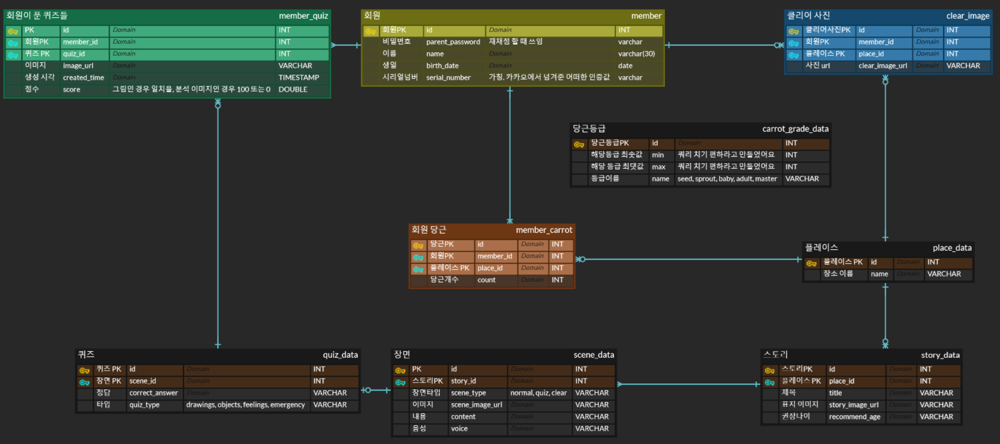
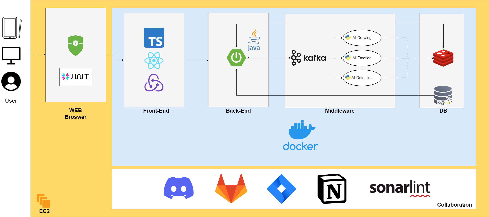
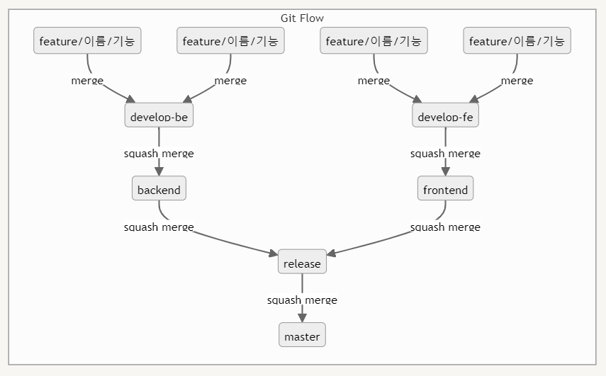
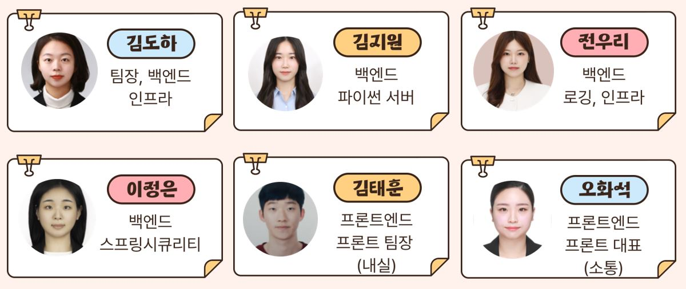

# 🐇 토비의 당근 밭
삼성 청년 SW 교육

AI를 기반으로 한 미취학 아동 교육

프로젝트 기간 : 2024.02.19 - 2024.04.05 (7주)

# 📚 목차

1️⃣ [프로젝트 개요](#프로젝트 개요) 
2️⃣ [서비스 소개](#서비스 소개) 
3️⃣ [기술 스택](#기술-스택) 
4️⃣ [SW Document](#SW Document) 
5️⃣ [기능 소개](#기능 소개) 
6️⃣ [사용 방법](#기여하기) 
7️⃣ [팀 소개](#팀 소개) 
8️⃣ [설치 및 시작하기](#설치 및 시작하기) 
9️⃣ [라이센스](#라이센스) 

# 🌳 프로젝트 개요

기획 기간 : 2024.02.19 - 2024.02.28

설계 기간 : 2024.02.28 - 2024.03.08

프로젝트 개발 : 2024.03.08 - 2024.03.29

테스트 기간 : 2024.03.29 - 2024.04.08

# 💡 서비스 소개
미취학 아동이 체험형 스토리를 통해 언어 및 올바른 행동양식을 학습하는 서비스

체험형 스토리에서 주된 사용 기술은 사물인식, 모션인식, 그림인식이 있다.

#### 🎦 동영상

# ⚒️ 기술 스택

### ✓ Deploy

`AWS EC2` 
`Docker` 
`Docker-compose` 
`Nginx` 
`Jenkins` 

### ✓ Front-End

`Node JS` 
`TypeScript` 
`React` 
`styled-components` 
`Redux` 
`EsLint` 
`React-Query` 

### ✓ Back-End

`Java 17` 
`Spring Boot` 
`Spring Security` 
`Spring Data JPA` 
`OAuth` 
`JWT` 
`Gradle` 
`Python` 
`Lombok` 

### ✓ DB

`MySQL` 
`Redis` 

### ✓ Collaboration

`Git-Lab` 
`Notion` 
`JIRA` 
`MattarMost` 
`ERD Cloud` 
`Figma` 
`FigJam` 

### ✓ AI Model

`Object Detection` 
`Drawing` 
`Emotion Detection` 

# ✏️ SW Document

### 📊 ERD Diagram

### 🏗 System Architecture

### 🔮 핵심기술
- Spring Security
- KafKa
- AI모델 : inceptionV3, doodle, mobileNet

### 🚀 Git Flow

<!-- # 📍 사용 방법
### 🎨 설치 및 시작하기 -->

# 💾 기능 소개

- 로그인 화면

- 튜토리얼 처음 유저를 위한 안내페이지

- 메인 화면

- AI모델 Object Quiz

- AI모델 Emotion Quiz

- AI모델 Drawing Quiz

- 분석 화면 (미완료)

- 스토리 클리어 기념사진 당근밭 화면

# 🐣 팀 구성

## 팀원

<!-- <table>
  <tbody>
    <tr>
      <td align="center"><a href=""> <b>팀장 : 김도하</b></a> </td>
      <td align="center"><a href=""> <b>BE 팀원 : 김지원</b></a> </td>
      <td align="center"><a href=""> <b>FE 팀원 : 김태훈</b></a> </td>
      <td align="center"><a href=""> <b>FE 팀원 : 오화석</b></a> </td>
     <tr/>
      <td align="center"><a href=""> <b>BE 팀원 : 이정은</b></a> </td>
      <td align="center"><a href=""> <b>BE 팀원 : 전우리</b></a> </td>

    </tr>
  </tbody>
</table> -->

# 🎲 라이센스

### 주요 사용 라이브러리
- react-signature-canvas
    - https://www.npmjs.com/package/react-signature-canvas
- react-webcam
    - https://www.npmjs.com/package/react-webcam
- react-calendar
    - https://www.npmjs.com/package/react-calendar
- react-datepicker
    - https://www.npmjs.com/package/react-datepicker

### 참고 사이트
- Protected Route 구성
    - [https://velog.io/@frontendohs/React로-Protected-Router-구성하기](https://velog.io/@frontendohs/React%EB%A1%9C-Protected-Router-%EA%B5%AC%EC%84%B1%ED%95%98%EA%B8%B0)
    - https://medium.com/@chiragmehta900/creating-protected-routes-in-react-js-with-react-router-v6-28f3a3ac53d
    - https://cbi-analytics.nl/react-js-create-protected-routes-in-react-router-6/
- Custom Cursor
    - https://www.geeksforgeeks.org/custom-cursor-using-react-js/
    - https://newline.tistory.com/149
- 다크모드 관련
    - [https://velog.io/@planic324/다크모드-대응기](https://velog.io/@planic324/%EB%8B%A4%ED%81%AC%EB%AA%A8%EB%93%9C-%EB%8C%80%EC%9D%91%EA%B8%B0)
- 웹캠 이미지 파일 변환 (base64 → image)
    - http://www.jongminjang.com/html5/file/2018/12/27/blob-as-img-src.html
    - https://blog.logrocket.com/using-react-webcam-capture-display-images/
- PWA
    - https://developer.chrome.com/docs/workbox/caching-strategies-overview?hl=ko
    - https://developer.chrome.com/docs/workbox/precaching-dos-and-donts?hl=ko
    - https://s0n9h2.tistory.com/122
    - https://t-i-show.medium.com/build-a-pwa-with-next-js-and-typescript-94ead0e3e6f2
- CSS
    - [https://velog.io/@jhsung23/CSS-fff와-ffffff는-무슨-차이인가요](https://velog.io/@jhsung23/CSS-fff%EC%99%80-ffffff%EB%8A%94-%EB%AC%B4%EC%8A%A8-%EC%B0%A8%EC%9D%B4%EC%9D%B8%EA%B0%80%EC%9A%94)
    - https://naradesign.github.io/flex-grow-shrink.html
